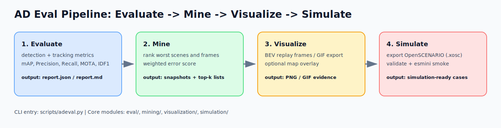
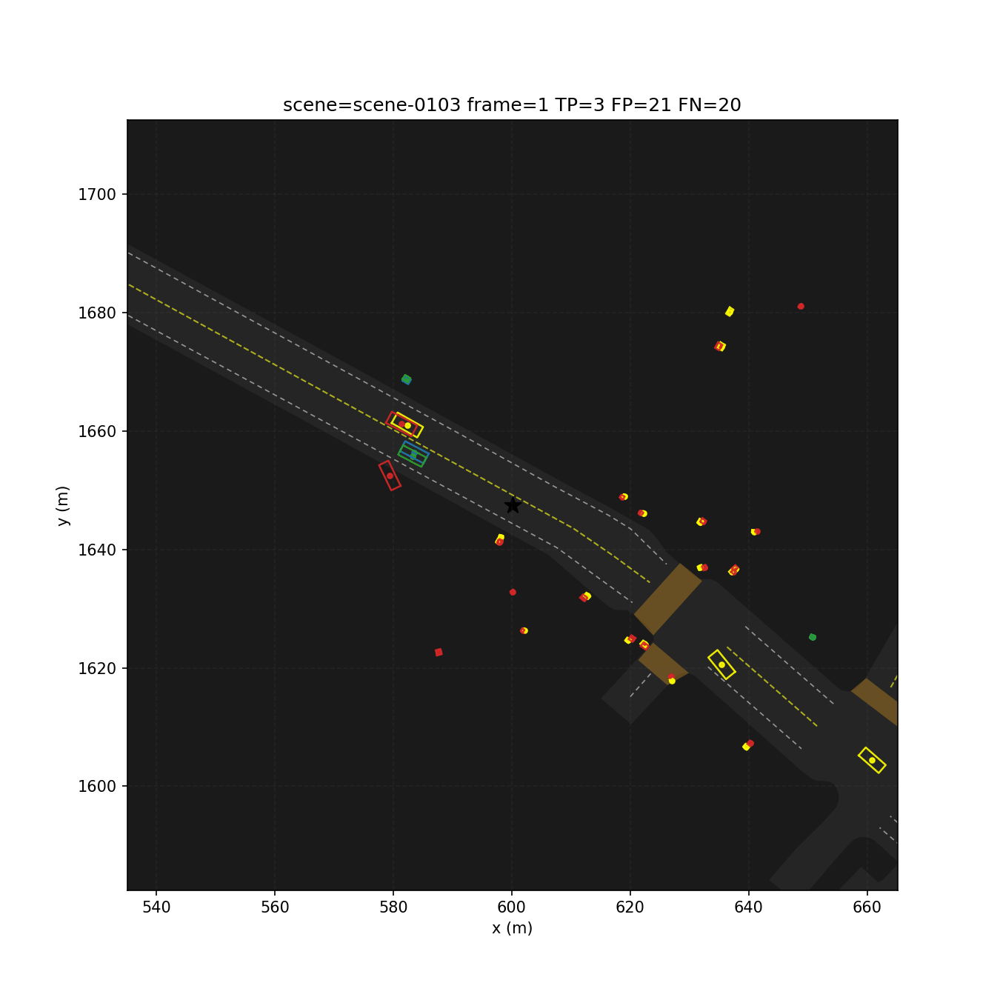
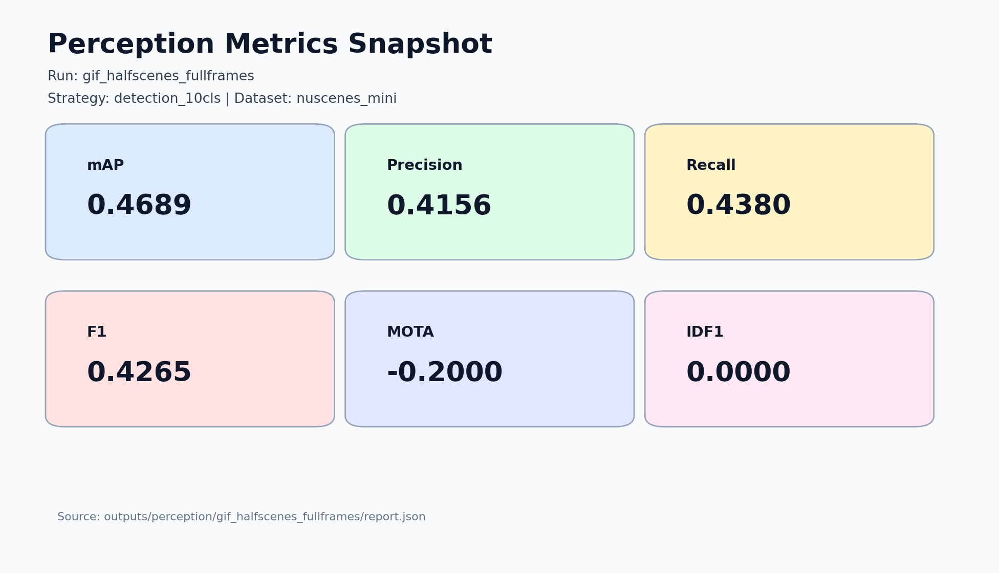
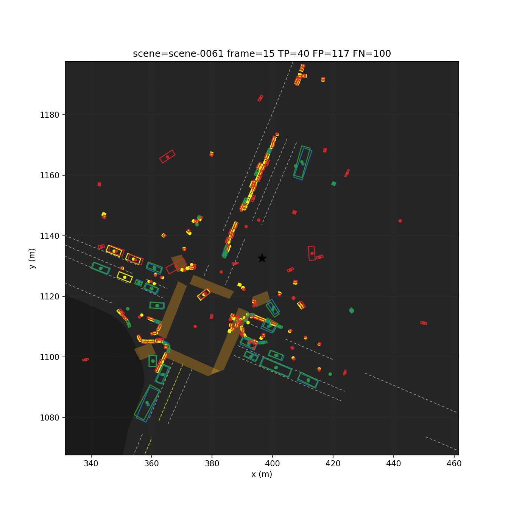
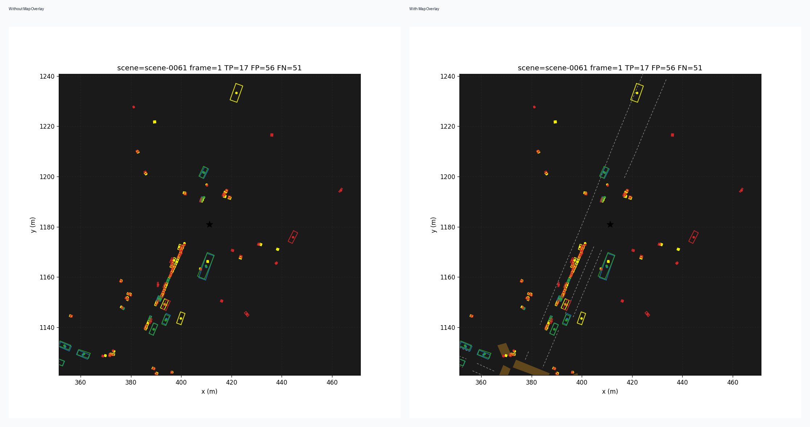
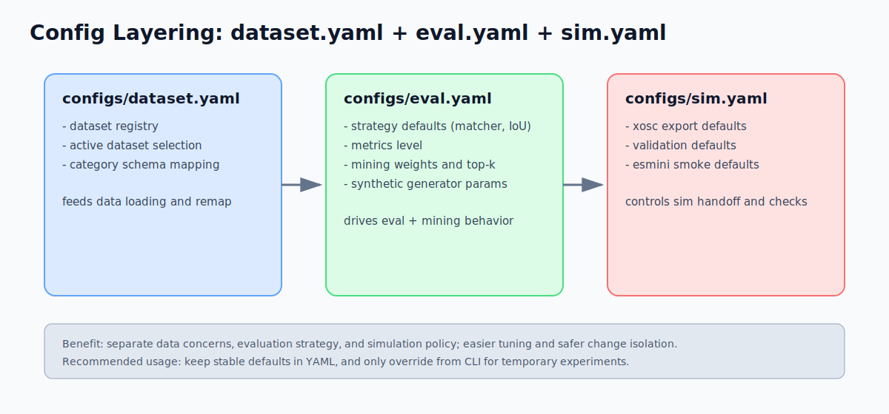

# ad-eval-suite

面向自动驾驶评测的工程化工具集，目标是“快速迭代、可复现、可展示”。

项目当前重点能力：

- 感知评测（检测 + 跟踪）
- 失败样本挖掘（最差场景 / 最差帧）
- 回放可视化（PNG / GIF）
- OpenSCENARIO 导出与校验（XOSC + esmini smoke）

## 功能展示

### 项目闭环流程图（评测 -> 挖掘 -> 可视化 -> 仿真）



### 失败场景 GIF（已挖掘 bad case）



### 指标结果截图（评测输出摘要）



### BEV 回放静态帧（含地图覆盖）



### 地图覆盖对比图（同帧对比）



## 项目功能模块

### 1. 评测模块（eval/）

- 检测指标：Precision / Recall / F1 / AP / mAP
- 跟踪指标：MOTA / MOTP / IDF1 / IDSW / MT / ML
- 通过策略 YAML 统一管理参数（raw / detection_10cls / l2_planning）

### 2. 挖掘模块（mining/）

- 基于加权错误分数排序最差场景与最差帧
- 导出 snapshot JSON，便于复现与定位问题
- 挖掘结果可直接联动可视化与仿真导出

### 3. 仿真模块（simulation/）

- snapshot 导出 OpenSCENARIO（.xosc）
- XML/XSD 结构校验
- esmini headless smoke 快速验证可运行性

### 4. 可视化模块（visualization/）

- 俯视图逐帧渲染
- GIF 导出
- 可选 nuScenes 地图覆盖（车道线、可行驶区域）

## 统一 CLI（推荐入口）

主入口：`scripts/adeval.py`

```bash
# 查看全部命令
python scripts/adeval.py --help

# 1) 全流程感知评测
python scripts/adeval.py eval

# 2) 指定策略 + 子集场景 + 导出产物
python scripts/adeval.py eval \
    --strategy l2_planning \
    --scenes first \
    --export-gif \
    --map \
    --export-sim \
    --run-name demo_l2

# 3) 基于历史 run 再导出挖掘产物
python scripts/adeval.py mine outputs/perception/demo_l2 --export-gif --export-sim

# 4) 校验 OpenSCENARIO
python scripts/adeval.py sim validate outputs/perception/demo_l2/failure_mining/xosc

# 5) esmini smoke
python scripts/adeval.py sim smoke outputs/perception/demo_l2/failure_mining/xosc --dry-run

# 6) 直接回放 snapshot
python scripts/adeval.py viz replay outputs/perception/demo_l2/failure_mining/snapshots/scene-0061_snapshot.json \
    --save-gif /tmp/scene-0061.gif --map
```

兼容说明：`scripts/run_perception_eval.py` 仍保留，方便已有脚本和 CI 继续使用。

## 配置架构



配置按“数据 / 评测 / 仿真”解耦：

- `configs/dataset.yaml`
    - 数据集注册
    - active dataset
    - 类别映射 schema
- `configs/eval.yaml`
    - 策略默认参数（matcher、IoU、metrics level）
    - perception/prediction/planning 设置
    - mining 权重与 top-k 设置
    - synthetic generator 设置
- `configs/sim.yaml`
    - 仿真导出默认设置
    - xosc 校验默认设置
    - esmini smoke 默认设置

## 快速运行

### 1. 环境准备

```bash
git clone https://github.com/cola1917/ad-eval-suite.git
cd ad-eval-suite

python3 -m venv .venv
source .venv/bin/activate
pip install -r requirements.txt
```

### 2. 数据准备

将 nuScenes mini 放在：

```text
data/nuscenes-mini/
    maps/
    samples/
    sweeps/
    v1.0-mini/
```

### 3. 首次运行

```bash
python scripts/adeval.py eval --run-name first_run
```

输出目录：

```text
outputs/perception/first_run/
    report.json
    report.md
    topn/
    failure_mining/
```

## 当前范围说明

- 已可稳定使用：perception eval、mining、visualization、simulation export/validation/smoke
- 仍是占位脚手架：prediction/planning/e2e 的独立 CLI

## 目录速览

```text
configs/         dataset/eval/sim 配置
datasets/        数据加载
eval/            指标评测
mining/          失败挖掘与排序
simulation/      xosc 导出与校验
visualization/   回放与地图覆盖
scripts/         统一 CLI 与兼容脚本
tests/           单测与回归测试
images/          README 展示素材
```